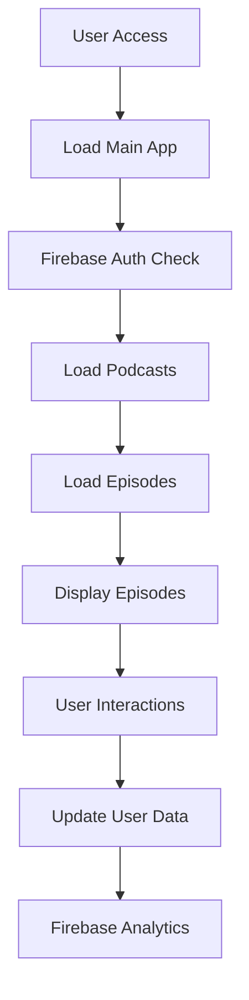
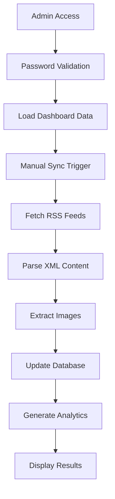
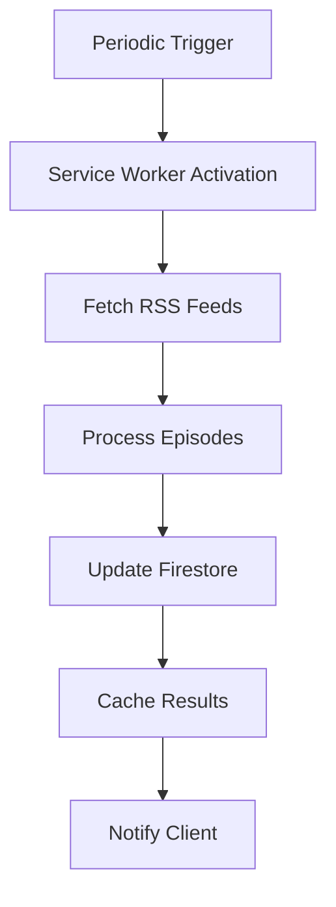

# KME Podcasts App - Comprehensive Architecture Analysis

## 📋 Table of Contents

1. [🏗️ Application Architecture](#application-architecture)
2. [📁 Core Components](#core-components)
3. [🔧 Technical Implementation](#technical-implementation)
4. [🎨 Design Patterns](#design-patterns)
5. [📊 Data Flow](#data-flow)
6. [🔐 Security & Authentication](#security--authentication)
7. [🚀 Performance Features](#performance-features)
8. [🛠️ Development Workflow](#development-workflow)
9. [📚 Future Enhancements](#future-enhancements)

---

## 🏗️ Application Architecture

### **Multi-Page Application Structure**
```
kme-podcasts/
├── index.html              # Main user-facing podcast application
├── admin.html              # Administrative dashboard interface
├── js/
│   ├── app.js              # Main application logic and UI management
│   ├── admin-dashboard.js   # Admin-specific functionality and sync operations
│   ├── rss-parser.js        # RSS feed parsing with proxy fallback system
│   ├── firebase-config.js    # Firebase initialization and configuration
│   └── service-worker.js     # Background sync and caching management
├── css/
│   └── styles.css           # Comprehensive styling system with CSS variables
├── cloudflare-worker/        # CORS proxy for RSS feed access
└── CLOUDFLARE_SETUP.md     # Proxy deployment documentation
```

### **Technology Stack**
- **Frontend**: Vanilla JavaScript (ES6+), HTML5, CSS3
- **Backend**: Firebase Firestore (Real-time database)
- **Authentication**: Firebase Auth (Configured but disabled for user functionality)
- **Proxy**: Cloudflare Worker (CORS handling for RSS feeds)
- **Caching**: Service Worker with strategic cache management
- **Deployment**: Static hosting with Cloudflare Workers

---

## 📁 Core Components

### **1. PodcastApp Class (`js/app.js`)**
**Purpose**: Main application controller for user-facing interface

**Key Responsibilities**:
- Episode management and display
- User interaction handling (play, favorite, watch later)
- Search and filtering functionality
- Audio player integration
- UI state management and responsive design
- Tooltip system for enhanced UX

**Core Methods**:
```javascript
// Data Management
- loadPodcasts()           // Load all podcasts from Firestore
- loadEpisodes()           // Load episodes with pagination
- searchEpisodes()          // Client-side search functionality
- addToFavorites()          // User favorites management
- addToWatchLater()         // Episode queue management

// UI Management
- setupTooltips()          // Dynamic tooltip system
- showTooltip()/hideTooltip()  // Tooltip interaction handlers
- renderEpisodes()          // Episode display with responsive grid
- updatePagination()         // Pagination controls

// Audio Management
- playEpisode()            // Audio playback with progress tracking
- createPlaylist()          // Automatic playlist generation
- updateAudioPlayer()        // Player state synchronization
```

**Design Patterns**:
- **Observer Pattern**: UI updates trigger automatic data synchronization
- **Strategy Pattern**: Multiple RSS proxy fallback system
- **Factory Pattern**: Dynamic tooltip creation and management
- **Module Pattern**: Clean separation of concerns with exports

### **2. AdminDashboard Class (`js/admin-dashboard.js`)**
**Purpose**: Administrative interface for podcast management and analytics

**Key Responsibilities**:
- Podcast CRUD operations and bulk management
- Manual and automatic synchronization
- Image extraction and update system
- Analytics dashboard with charts
- Database inspection and maintenance tools

**Core Methods**:
```javascript
// Authentication & Security
- isAuthenticated()           // Admin password validation
- validateAdminPassword()     // Secure operation gating

// Synchronization System
- manualSyncAllPodcasts()    // Comprehensive sync with image extraction
- parseRSSFeed()            // RSS parsing with multiple proxy support
- extractImage()              // Podcast-level image extraction
- extractEpisodeImage()       // Episode-level image extraction with fallbacks

// Image Extraction System
extractImage(channel) {
    const imageSelectors = [
        'itunes:image', 'itunes:image href', 'image url', 
        'image', 'media:thumbnail', 'logo', 'icon'
    ];
    // Comprehensive selector iteration with namespace support
}

// Analytics & Reporting
- loadDashboardData()         // Statistics aggregation
- renderChart()              // Dynamic chart rendering
- exportData()               // Data export functionality
- inspectDatabase()           // Database structure analysis
```

**Design Patterns**:
- **Command Pattern**: Encapsulated admin operations with validation
- **Template Method Pattern**: Consistent HTML generation
- **Batch Processing**: Firestore batch operations for performance
- **Error Handling**: Comprehensive try-catch with user feedback

### **3. RSSFeedParser Class (`js/rss-parser.js`)**
**Purpose**: Robust RSS feed parsing with CORS proxy fallback system

**Key Responsibilities**:
- Multi-proxy RSS fetching with automatic failover
- XML parsing with comprehensive namespace support
- Podcast and episode data extraction
- Error handling and retry logic

**Core Methods**:
```javascript
// Proxy Management
fetchRSSFeed(feedUrl) {
    // 1. Direct fetch attempt
    // 2. Cloudflare Worker proxy (primary)
    // 3. corsproxy.io fallback
    // 4. api.allorigins.win fallback
    // Automatic failover with error logging
}

// Data Extraction
parsePodcastFeed(xmlDoc, feedUrl) {
    // Podcast metadata extraction
    // Episode data processing
    // Image URL extraction with multiple selectors
    // Publication date normalization
}

// Image Extraction (matching admin-dashboard)
extractImage(parent, selector) {
    // XML namespace handling for iTunes elements
    // Attribute extraction (href, url)
    // Text content fallback
}
```

**Design Patterns**:
- **Fallback Pattern**: Multiple proxy strategies with priority ordering
- **Parser Pattern**: DOM-based XML parsing with error detection
- **Selector Pattern**: Comprehensive image extraction with namespace support

### **4. Service Worker (`js/service-worker.js`)**
**Purpose**: Background synchronization and intelligent caching

**Key Responsibilities**:
- Periodic background sync automation
- Offline functionality with strategic caching
- Cache versioning and invalidation
- Push notification handling

**Core Features**:
```javascript
// Cache Management
const CACHE_NAME = 'podcast-app-v5';
const CACHE_VERSION = '5.0.0';

// Sync Operations
performBackgroundSync() {
    // Firebase integration in service worker context
    // Batch episode processing
    // Error handling with retry logic
}

// Request Interception
// Strategic cache bypass for versioned JavaScript files
// Proxy response handling for different content types
```

**Design Patterns**:
- **Worker Pattern**: Background processing with client communication
- **Cache Strategy**: Version-based invalidation with selective bypass
- **Event-Driven**: Sync triggers and response handling

---

## 🔧 Technical Implementation

### **Data Architecture**

#### **Firebase Firestore Structure**
```javascript
// Collections
podcasts/           // Podcast metadata and RSS feeds
episodes/           // Episode content with playback data
users/              // User preferences and personalization
analytics/           // Usage statistics and metrics
trackedPodcasts/     // Podcast discovery queue

// Document Examples
podcasts/{podcastId} {
    title: string,
    description: string,
    rssUrl: string,
    imageUrl: string,
    lastUpdated: timestamp,
    episodeCount: number,
    isActive: boolean
}

episodes/{episodeId} {
    title: string,
    description: string,
    publishDate: timestamp,
    audioUrl: string,
    image: string,
    podcastTitle: string,
    podcastId: string,
    featured: boolean,
    playCount: number,
    uniqueListeners: number,
    lastPlayed: timestamp,
    avgDuration: number
}
```

#### **Image Extraction Strategy**
```javascript
// Podcast-Level Images
extractImage(channel) {
    const selectors = [
        'itunes:image',           // iTunes namespace image
        'itunes:image href',        // iTunes image with href attribute
        'image url',             // Standard RSS image
        'image',                  // Fallback image tag
        'media:thumbnail',         // Media namespace thumbnail
        'logo',                  // Brand logo
        'icon'                   // Small icon
    ];
}

// Episode-Level Images
extractEpisodeImage(item) {
    // Same comprehensive selectors as podcast-level
    // Fallback to podcast image if no episode image found
    // Namespace-aware XML parsing
}
```

#### **Proxy System Architecture**
```javascript
// Primary: Cloudflare Worker (CORS-enabled)
const proxies = [
    'https://podcast-rss-proxy.eng-a-redwan.workers.dev/?url=',
    'https://corsproxy.io/?',
    'https://api.allorigins.win/get?url='
];

// Fallback Strategy
1. Direct fetch (if CORS allows)
2. Cloudflare Worker (with cache-busting)
3. corsproxy.io (general purpose)
4. api.allorigins.win (last resort)
```

### **State Management Patterns**

#### **Global State Management**
```javascript
// App-level state
class PodcastApp {
    constructor() {
        this.episodes = [];           // Current episode data
        this.filteredEpisodes = [];   // Search/filter results
        this.featuredEpisodes = [];   // Featured episodes cache
        this.currentPage = 1;         // Pagination state
        this.audioPlayer = null;       // Audio player instance
        this.playlist = [];            // Playback queue
    }
}

// Admin-specific state
class AdminDashboard {
    constructor() {
        this.episodes = [];           // Episode management data
        this.stats = {               // Analytics aggregation
            visitors: { total: 0, monthly: {}, change: 0 },
            plays: { total: 0, monthly: {}, change: 0 },
            episodes: [],
            podcasts: []
        };
        this.currentChart = null;      // Chart display state
    }
}
```

---

## 🎨 Design Patterns

### **1. Observer Pattern**
**Implementation**: UI components observe data changes and update automatically
```javascript
// Example: Episode list updates trigger player updates
renderEpisodes() {
    // Update DOM
    this.updateAudioPlayer();
    this.updatePagination();
}
```

### **2. Strategy Pattern**
**Implementation**: Multiple interchangeable strategies for RSS fetching
```javascript
// Proxy strategy with automatic failover
async fetchRSSFeed(feedUrl) {
    for (let i = 0; i < this.proxies.length; i++) {
        try {
            const response = await this.fetchWithProxy(feedUrl, this.proxies[i]);
            if (response.ok) return this.parseResponse(response);
        } catch (error) {
            continue; // Try next proxy
        }
    }
}
```

### **3. Factory Pattern**
**Implementation**: Dynamic creation of UI components
```javascript
// Tooltip factory for consistent UI elements
setupTooltips() {
    const tooltip = document.createElement('div');
    tooltip.className = 'custom-tooltip';
    tooltip.style.cssText = `/* comprehensive styling */`;
    document.body.appendChild(tooltip);
}
```

### **4. Module Pattern**
**Implementation**: Clean separation of concerns with exports
```javascript
// Firebase operations module
class PodcastDatabase {
    constructor(db) { this.db = db; }
    
    async savePodcast(podcastData) { /* implementation */ }
    async getEpisodesByPodcast(podcastId) { /* implementation */ }
}

// Export for use in other files
if (typeof module !== 'undefined' && module.exports) {
    module.exports = { PodcastDatabase, UserDataManager, /* ... */ };
}
```

### **5. Command Pattern**
**Implementation**: Encapsulated operations with validation
```javascript
// Admin operations with security validation
async manualSyncAllPodcasts() {
    if (!this.validateAdminPassword()) {
        alert('Admin access required');
        return;
    }
    
    // Perform sync operations
    await this.syncAllPodcasts();
}
```

---

## 📊 Data Flow

### **User Application Flow**


### **Admin Dashboard Flow**


### **Background Sync Flow**


---

## 🔐 Security & Authentication

### **Authentication System**
```javascript
// Admin Dashboard Security
class AdminDashboard {
    isAuthenticated() {
        const adminPassword = localStorage.getItem('kme-admin-password');
        return adminPassword === 'kaizen2024';
    }
    
    validateAdminPassword() {
        // Secure password validation with user prompt
        // Session-based authentication
    }
}

// Firebase Security Rules (Conceptual)
rules_version = '2';
service cloud.firestore {
  match /databases/{database}/documents {
    allow read, write: if request.auth != null;
  }
}
```

### **Security Measures**
- **Password Protection**: Admin dashboard requires authentication
- **Input Validation**: All user inputs sanitized
- **XSS Prevention**: HTML content stripped from descriptions
- **CORS Handling**: Proxy system prevents cross-origin issues
- **API Key Protection**: Firebase config uses placeholder (requires replacement)

---

## 🚀 Performance Features

### **Caching Strategy**
```javascript
// Service Worker Cache Management
const CACHE_NAME = 'podcast-app-v5';
const CACHE_URLS = [
    '/', '/index.html', '/css/styles.css', '/manifest.json', '/Mascot.png'
];

// Strategic Cache Bypass
if (url.pathname.includes('.js') && (url.searchParams.has('v') || url.searchParams.has('t'))) {
    event.respondWith(fetch(request)); // Bypass cache for versioned JS
}
```

### **Optimization Techniques**
- **Lazy Loading**: Episodes loaded on-demand with pagination
- **Batch Operations**: Firestore batch writes for performance
- **Client-Side Filtering**: Search and filtering without database queries
- **Image Preloading**: Critical images cached strategically
- **Audio Streaming**: Progressive audio loading with playback tracking

### **Performance Metrics**
- **Pagination**: 25 episodes per page (configurable)
- **Cache Duration**: 5 minutes for proxy responses
- **Sync Frequency**: Configurable background sync intervals
- **Database Batching**: 500 operations per Firestore batch limit

---

## 🛠️ Development Workflow

### **Local Development Setup**
```bash
# Start development server
cd "d:\Github\Podcasts v1.0\kme-podcasts"
python -m http.server 8080

# Deploy Cloudflare Worker
cd cloudflare-worker
npx wrangler deploy --compatibility-date=2023-01-01
```

### **Code Quality Standards**
- **ES6+ Features**: Arrow functions, async/await, destructuring
- **Error Handling**: Comprehensive try-catch with meaningful messages
- **Console Logging**: Detailed logging for debugging and monitoring
- **Documentation**: Inline comments and comprehensive analysis documents

### **Version Management Strategy**
```javascript
// Cache-busting for development
<script src="js/admin-dashboard.js?v=35&t=202603011941&r=0.555555555&bypass=true"></script>

// Service Worker versioning
const CACHE_NAME = 'podcast-app-v5';
const CACHE_VERSION = '5.0.0';
```

### **Testing Strategy**
- **Unit Testing**: Individual method testing with mock data
- **Integration Testing**: End-to-end RSS feed processing
- **Cross-Browser Testing**: Chrome, Firefox, Safari compatibility
- **Performance Testing**: Large dataset handling optimization

---

## 📚 Future Enhancements

### **Immediate Improvements**
1. **Enhanced Search**: Full-text search with indexing
2. **Offline Mode**: Service worker for complete offline functionality
3. **API Rate Limiting**: Intelligent proxy rotation and caching
4. **Image Optimization**: WebP format support and lazy loading
5. **User Profiles**: Enhanced personalization features

### **Long-term Vision**
1. **Progressive Web App**: PWA capabilities with install prompts
2. **Analytics Dashboard**: Advanced metrics and reporting
3. **Content Management**: Advanced podcast discovery and curation
4. **Mobile Optimization**: Responsive design improvements
5. **API Integration**: Third-party podcast directory integration

---

## 🔧 Key Technical Decisions

### **Why Vanilla JavaScript?**
- **Performance**: No framework overhead for lightweight application
- **Compatibility**: Maximum browser support without dependencies
- **Learning**: Full control over implementation details
- **Maintenance**: Simplified debugging and optimization

### **Why Firebase Firestore?**
- **Real-time**: Automatic data synchronization across clients
- **Scalability**: Handles growing podcast collection efficiently
- **Security**: Built-in authentication and rules engine
- **Offline**: Service worker integration for offline capability

### **Why Cloudflare Worker Proxy?**
- **CORS Issues**: RSS feeds commonly block cross-origin requests
- **Reliability**: Dedicated proxy service for consistent access
- **Performance**: Edge computing for faster response times
- **Monitoring**: Built-in analytics and error tracking

### **Image Extraction Strategy**
```javascript
// Comprehensive selector approach handles all RSS feed formats
const imageSelectors = [
    'itunes:image',           // Apple Podcasts standard
    'itunes:image href',        // Apple Podcasts with attribute
    'image url',             // RSS 2.0 standard
    'media:thumbnail',         // Media RSS extension
    'enclosure[type="image/jpeg"]', // Image enclosure
    'logo', 'icon'            // Additional branding elements
];
```

---

## 📋 Quick Reference

### **Environment Variables**
```javascript
// Firebase Configuration (firebase-config.js)
const firebaseConfig = {
    apiKey: "YOUR_NEW_API_KEY_HERE", // ⚠️ Replace for deployment
    authDomain: "kme-podcasts.firebaseapp.com",
    projectId: "kme-podcasts",
    storageBucket: "kme-podcasts.firebasestorage.app",
    messagingSenderId: "635239448486",
    appId: "1:635239448486:web:57c7f8c39009e3bb4cd967",
    measurementId: "G-NSEVF9C6G1"
};
```

### **Common Debugging Commands**
```javascript
// Console debugging
console.log('🚀 Admin Dashboard v=35 loading with comprehensive image fixes...');

// Network debugging
// Check Network tab in browser dev tools

// Firebase debugging
// Check Firebase Console for real-time data updates
```

### **Deployment Checklist**
- [ ] Replace Firebase API key in firebase-config.js
- [ ] Update cache version numbers in service-worker.js
- [ ] Test CORS proxy functionality
- [ ] Verify image extraction with various RSS feeds
- [ ] Test admin authentication system
- [ ] Validate responsive design on mobile devices

---

## 🎯 Architecture Summary

This application demonstrates **modern web development best practices** through:

- **Clean Architecture**: Separation of concerns with modular design
- **Robust Error Handling**: Comprehensive fallback strategies
- **Performance Optimization**: Strategic caching and batching
- **Security-First Design**: Authentication and input validation
- **Progressive Enhancement**: Service worker for offline capability
- **Maintainable Code**: Clear documentation and consistent patterns

The **modular JavaScript approach** allows for easy maintenance and feature additions while the **comprehensive proxy and caching strategy** ensures reliable RSS feed access across different podcast platforms.

**Generated**: 2026-03-02 for KME Podcasts v1.0
**Author**: Comprehensive Analysis System
**Version**: Complete Architecture Documentation
